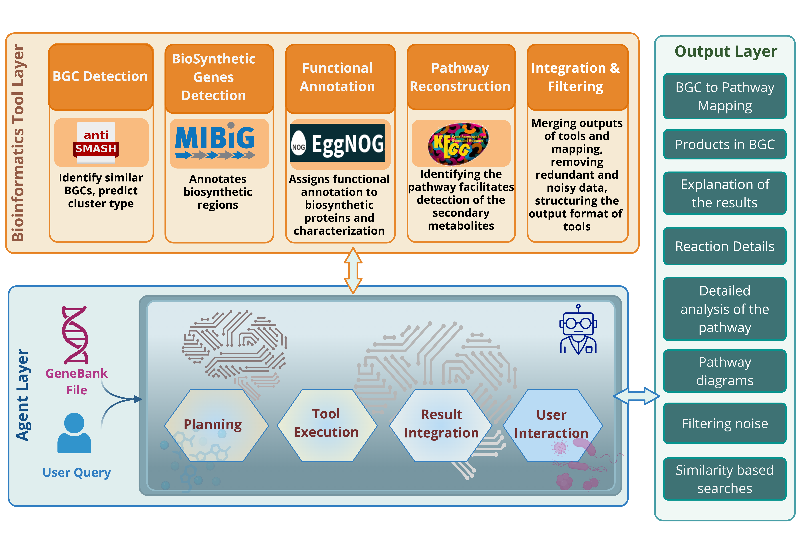

<h1><font color="#059669"> 🤖 Agent_K</font></h1>

**An Agent-Orchestrated Pipeline for Mapping Genes to Biosynthetic Pathway towards Metabolite Discovery**

## System Overview


## Features


- 🪄 **Agent-Orchestrated Workflow**
  - Automates the execution of the BGC analysis pipeline.

- 🧬 **BGC Prediction with antiSMASH**
  - Identifies putative biosynthetic gene clusters.

- 📚 **BGC Annotation with MIBiG**
  - Retrieves matching MIBiG entries and associated products.

- 📝 **Functional Annotation with eggNOG-mapper**
  - Annotates genes with functional information.

- 🗺️ **Pathway Reconstruction using KEGG**
  - Maps genes to KEGG pathways and generates pathway visualizations.

- 🔄 **Integration and Filtering**
  - Combines results from all tools and supports result filtering.

## 📦 Installation

### Prerequisites

Before running **Agent_K**, install the following external tools:

| Tool | Purpose | Installation |
|------|---------|--------------|
| **antiSMASH** | Biosynthetic gene cluster prediction | https://github.com/antismash/antismash |
| **eggNOG-mapper** | Functional annotation | https://github.com/eggnogdb/eggnog-mapper |

> **Note:** Please follow the official installation instructions for each tool, including any required databases and dependencies.

### Clone the repository

```bash
git clone https://github.com/RajShekhorRoy/Agent_K.git
cd Agent_K
```

### Install Python dependencies

```bash
pip install -r requirements.txt
```

## 🚀 Running Agent_K

Start the Streamlit application:

```bash
streamlit run app_streamlit.py
```

Once the application starts, open your browser and navigate to:

```text
http://localhost:8501
```